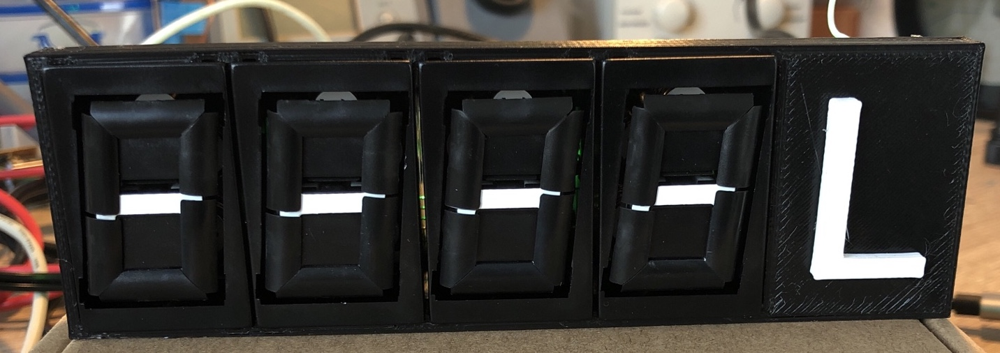
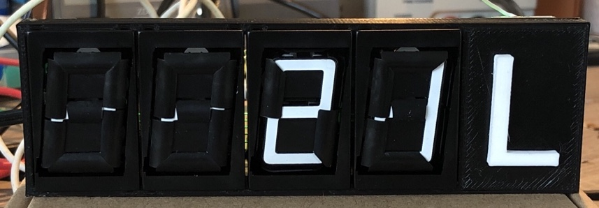
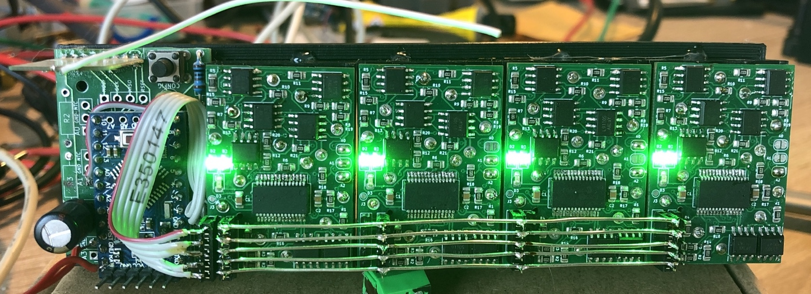

# HB-UNI-Rec-VAL-EM7SEG
#### abgesetzte 7-Segment Anzeige für die Regenwasserzisterne

Derzeit erfolgt die Messwert-Ermittlung und -Übertragung des Wasserstands mittels [HB-UNI-Sen-LEV-US](https://github.com/jp112sdl/HB-UNI-Sen-LEV-US) an die HomeMatic CCU. 
Die Anzeige des Inhalts erfolgt im Haus auf 2 ePaper Displays, sowie auf einer mobilen Visualisierung auf dem iPhone.
 
Was fehlte, war eine direkte Anzeige im Garten - dort wo ich das Wasser benötige. 
  
Ich hatte noch aus einem meiner anderen Projekte ([EM7SEG](https://github.com/jp112sdl/EM7SEG)-Uhr) ein paar mechanische 7-Segmentanzeigen (_bekannt aus früheren Tank-Zapfsäulen_) übrig.
 
Ab und zu bekommt man noch welche bei eBay: https://www.ebay.de/itm/174249670792
  
Der [HB-UNI-Sen-LEV-US](https://github.com/jp112sdl/HB-UNI-Sen-LEV-US) sendet nun alle paar Minuten den aktuellen Füllstand an die CCU.
Diese Funktelegramme werden vom HB-UNI-Rec-VAL-EM7SEG direkt empfangen und angezeigt. 
**Vorteile:**
- Der anzuzeigende Wert muss nicht extra wieder an die Anzeige gesendet werden.
- Das HB-UNI-Rec-VAL-EM7SEG taucht in keiner Konfiguration auf, sondern läuft nur als "Mithörer" nebenher. Es müssen somit keine Vorkehrungen getroffen werden, falls es mal nicht erreichbar ist (im Winter z.B.) 

 
_Unreach-Timeout überschritten; Kein Telegramm innerhalb der vorgegebenen Zeit empfangen_

 
_Wert empfangen (21 Liter ^^)_

 
_Innenleben_

